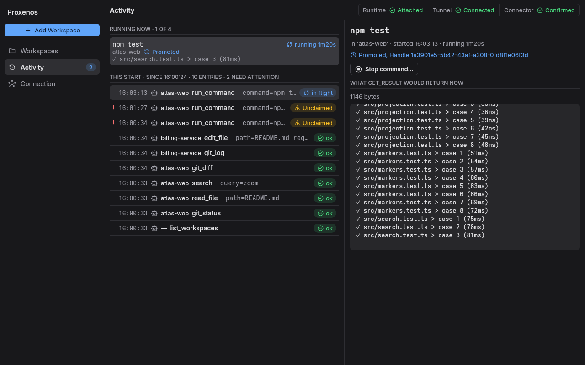
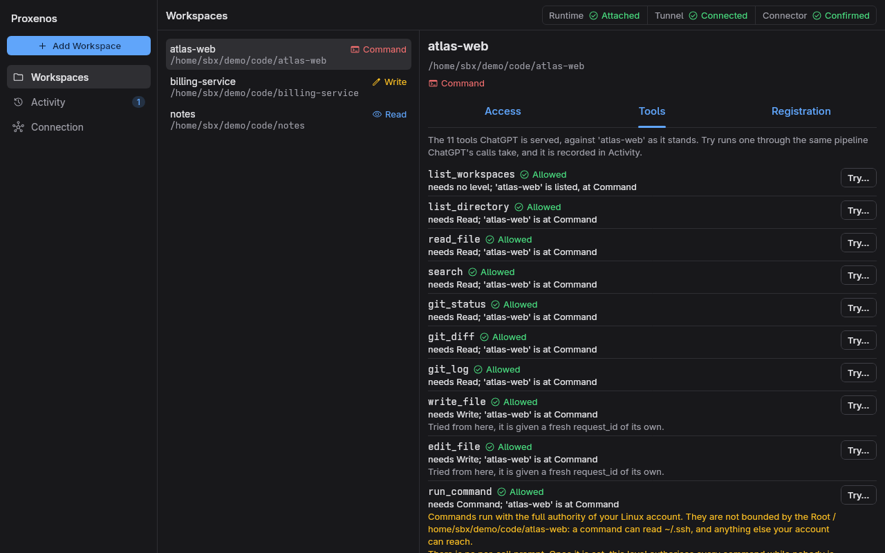
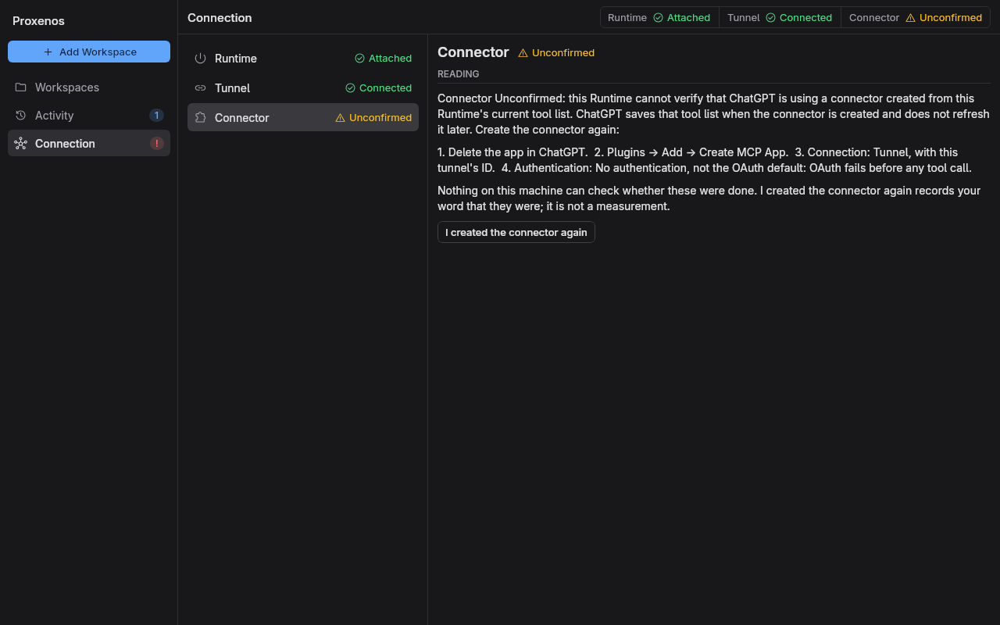

# Proxenos

[](https://m8ven.ai/mcp/kzagoris/proxenos?s=readme)

*Proxenos for ChatGPT.* In ancient Greece a *proxenos* was a citizen who hosted and acted for a
foreign city's envoys; this one hosts ChatGPT on your machine.

Connect ChatGPT to selected directories on your Linux machine. Proxenos lets ChatGPT read files, search code, inspect Git changes, edit files, and run commands according to the access level you choose for each workspace.

A desktop app and a terminal dashboard manage your workspaces and show what ChatGPT does in them. A separate Runtime answers tool calls through the **OpenAI Secure MCP Tunnel** and continues running when you close either one.



```text
ChatGPT → OpenAI Secure MCP Tunnel → local Runtime → your workspaces
                                          ↑
                                desktop app · terminal dashboard
```

The Runtime uses local Unix sockets and manages the tunnel client itself. No public HTTP listener is needed on your machine.

## What you can do

- Register several directories, each with its own name and access level.
- Let ChatGPT browse files, search contents, and inspect Git status, diffs, and history.
- Enable file creation and editing for selected workspaces.
- Enable commands for builds, tests, and other local work.
- Watch Activity live, follow a running command's output as it prints, and stop it.
- Try any tool yourself, through the same path ChatGPT's calls take, before ChatGPT does.
- Retrieve results from commands that outlast their initial tool call.

## The desktop app

The desktop app (`bin/gui`) puts everything the Runtime exposes in one window, with three
destinations in its sidebar:

- **Workspaces** lists every registered directory with its access level. Select one to set
  its level under **Access**, see under **Tools** exactly which tools ChatGPT is served against it
  and **Try…** any of them, or rename, move or forget it under **Registration**.
- **Activity** shows the calls of the current Runtime run as they happen. Running commands sit at
  the top with their latest output; select one to read what `get_result` would return now, or
  **Stop command…**. Entries that need your attention are flagged.
- **Connection** has one row each for the **Runtime**, the **Tunnel** and the ChatGPT
  **Connector**, with what each reading means and what to do about it: start or stop the
  Runtime, connect or disconnect the tunnel, and the steps for creating the connector in ChatGPT.



The status line at the top shows all three stages from every view. Raising a workspace to
Command asks for confirmation first. The window follows your desktop's light or dark setting
while it is open, and `Ctrl+1`, `Ctrl+2` and `Ctrl+3` switch views, `Ctrl+N` adds a workspace,
`Esc` goes back and `Ctrl+W` closes the window. Closing it leaves the Runtime running.

The terminal dashboard (`bin/tui`) offers the same management from a terminal and works on any
architecture. Both attach to the same Runtime, and you can use them side by side.

## Requirements

- **Linux**, with a terminal, Bash, Git, and `setsid` (usually supplied by util-linux).
- **JDK 26** to build and run the application. The repository includes the Gradle wrapper; the tool versions are recorded in [mise.toml](mise.toml).
- The official **`tunnel-client`** executable, available from [OpenAI Platform tunnel settings](https://platform.openai.com/settings/organization/tunnels) or the [official releases](https://github.com/openai/tunnel-client/releases/latest). Install it with the distribution’s `bin/install-tunnel-client`; it verifies the release checksum before placing it in the state directory’s `tools/`. See [installation instructions](docs/INSTALL.md).
- A ChatGPT account/workspace with **developer mode** available, plus access to OpenAI Platform tunnels. Availability depends on your account and workspace policy.
- A normal Linux login session with `XDG_RUNTIME_DIR` set, and outbound HTTPS access to OpenAI.
- For the desktop app: x86_64, and X11 or XWayland with libGL, libX11 and fontconfig.

Creating tunnels requires **Tunnels Read + Manage**; using them requires **Tunnels Read + Use**. Your tunnel must be associated with the ChatGPT workspace you will use. See the [official Secure MCP Tunnel guide](https://developers.openai.com/api/docs/guides/secure-mcp-tunnels) for access requirements and downloads.

## 1. Get the application

Download a release from [GitHub Releases](https://github.com/kzagoris/proxenos/releases/latest):

- **`proxenos-<version>-linux-x64.tar.gz`** carries the Runtime, TUI, GUI and Java runtime.
- **`proxenos-<version>.tar.gz`** carries the Runtime and TUI on any Linux architecture and
  needs a Java 26 runtime.

```bash
mkdir -p ~/.local/opt
tar -xzf proxenos-<version>-linux-x64.tar.gz -C ~/.local/opt
cd ~/.local/opt/proxenos-<version>-linux-x64
./bin/install-tunnel-client
```

The tree holds the launchers, the setup wizard, the verified tunnel installer, generated
third-party notices, and the installation guide. Keep it together: each frontend finds the
Runtime beside it automatically.
Run the commands below from this directory. Each release publishes `SHA256SUMS` and a build
provenance attestation; [the installation guide](docs/INSTALL.md) shows how to check both.

To build from source instead, `./gradlew installDist` lays out a development tree with the GUI
in `build/install/proxenos/`. It uses your installed Java 26; the linux-x64 archive adds `jre/`.

To put the desktop app in your application menu, run the optional installer from the linux-x64
tree:

```bash
./bin/install-desktop-entry
```

Re-run it after moving the tree, or pass `--remove` to remove the entry and icon. The desktop app
needs x86_64, X11 or XWayland, libGL, libX11 and fontconfig; native Wayland without XWayland is
unsupported. Startup diagnostics are appended to `$XDG_RUNTIME_DIR/proxenos/gui.log`. If it
opens at the wrong size, set `gui_scale` as the [installation guide](docs/INSTALL.md) describes.

## 2. Configure the OpenAI tunnel

Run the interactive setup wizard:

```bash
./bin/wizard
```

It walks you through creating a tunnel in OpenAI Platform, associating it with your ChatGPT workspace, obtaining a runtime API key, and enabling ChatGPT developer mode. Paste the tunnel ID and key into the wizard when prompted; key input is hidden.

The wizard saves these values in:

```text
${XDG_CONFIG_HOME:-~/.config}/proxenos/credentials
```

The file contains `TUNNEL_ID` and `RUNTIME_KEY` and is written with mode `0600` (readable and writable only by its owner). The Runtime refuses credentials with broader permissions. Keep this file outside the repository. The wizard supplies the credentials; the verified installer in step 1 supplies `tunnel-client`.

## 3. Open Proxenos and add a workspace

Open **Proxenos** from your application menu, or run:

```bash
./bin/gui
```

The desktop app starts the Runtime if necessary, then attaches to it.

1. Select **Add Workspace** (`Ctrl+N`).
2. Choose its root directory, or type the path, and give it a name such as `my-project`.
3. Leave it at **Read** for your first connection test.
4. Wait for **Tunnel** in the status line to show **Connected**.

From a terminal, or with the portable archive, run `./bin/tui` instead: press **`n`** to
register a directory, enter its root and a name, and wait for **Connected**.

Connected means the Runtime has a working link to the tunnel. Verify the full path with a ChatGPT tool call in the next section.

You can also register a workspace before starting the Runtime:

```bash
./bin/runtime register /absolute/path/to/project --name my-project
```

This command registers it at Read and requires the Runtime to be stopped. Use the desktop app or the dashboard to register directories while the Runtime is running.

## 4. Create the connection in ChatGPT

Keep the Runtime running throughout these steps.

1. In ChatGPT, open **Settings → Security and login** and enable **Developer mode**. A workspace administrator may need to grant access first.
2. Open **Plugins**, select **Add** at the top right, and choose **Create MCP App**. The **New Plugin** dialog opens.
3. Give it a name such as **Proxenos** and a description such as “Read and work with my registered local workspaces.”
4. Under **Connection**, switch from **Server URL** to **Tunnel** and enter the `tunnel_...` ID the wizard printed.
5. Set **Authentication** to **No authentication**. The dialog defaults to OAuth, which fails before any tool call. This application's MCP endpoint does not implement OAuth; the tunnel uses the runtime key you saved locally.
6. Tick **I understand and want to continue**, select **Create**, and then **Connect Proxenos**.
7. Start a new conversation, type **`@`**, and pick **Proxenos** from the **Plugins** list.

With ChatGPT's default permission, **Allow low-risk tools**, read-only calls such as `git_status` run at once, while calls that change files or run commands may ask for approval first. **See details** in that prompt shows the exact arguments, including the command.

These menu locations follow OpenAI's [connection guide](https://developers.openai.com/plugins/deploy/connect-chatgpt) as of September 2026. UI labels and availability can vary by account.

Ask ChatGPT:

> Use Proxenos to list my available workspaces. Then list the files at the root of my-project and summarize its README if one exists.

Confirm that ChatGPT receives the expected workspace and files, and that the calls appear in Activity.

If the status line shows **Connector · Unconfirmed**, open **Connection**, select **Connector**,
and select **I created the connector again** once you have created the connection. In the
dashboard, open **`i`** (Review), select the **Connector** row, press **`Enter`**, then uppercase
**`C`**. This acknowledgement records your word; it does not test ChatGPT connectivity.



## Access levels

Each workspace has one access level. Higher levels include the abilities below them.

| Level | What ChatGPT can do |
| --- | --- |
| **None** | Nothing. The workspace is hidden from discovery. |
| **Read** | List and read files, search, and inspect Git status, diffs, and history. |
| **Write** | Everything in Read, plus create, replace, and edit files. |
| **Command** | Everything in Write, plus run programs and collect their results. |

In the desktop app, select a workspace and choose its level under **Access**. **Tools** shows
which tools that level allows, and **Registration** renames it, moves it to another folder (back
at Read) or forgets it. An unavailable workspace offers **Re-confirm at Read** once you have
checked its directory.

In the dashboard, select a workspace with **↑/↓** and press **`m`** (Manage). There, **`0`–`3`**
set None, Read, Write, or Command; **`e`** renames it; **`w`** opens Tools. An unavailable
workspace has a Review action explaining how to re-confirm its directory. From Workspaces,
**`a`** opens Activity; select a running command there and press **`s`** to stop it. **`i`**
opens Runtime, with **`d`** to connect/disconnect and **`X`** to stop the Runtime after
confirmation. **Esc** goes back; **`q`** closes only the dashboard. Use **Page Up/Down** to
scroll long details.

Both show Activity for the current Runtime run only. Previous-run records remain in the Runtime
but never appear in either frontend.

**Command runs with the full authority of your Linux account.** The workspace root is the starting directory, not a sandbox: commands can access other files and resources your account can reach. Once enabled, the Runtime does not prompt for each command. Both frontends ask for confirmation when you raise a workspace to Command.

Closing the desktop app or the dashboard leaves the Runtime and its access levels in place. Lowering a level or disconnecting the tunnel does not stop work already running. Stop the command from Activity, or stop the Runtime, to end running work.

## How to use it from ChatGPT

Write your request in ChatGPT's normal message textbox and send it with the Proxenos connection enabled, as described in [the connection setup](#4-create-the-connection-in-chatgpt). Include the workspace name so ChatGPT knows where to work. You can use ordinary language or include an exact shell command; no JSON or special command prefix is needed.

### Run your first command

1. Open the desktop app and keep the Runtime running and Connected.
2. Select your registered workspace, choose **Command** under **Access**, and confirm with **Raise to Command**. In the dashboard, open **`m`** (Manage), press **`3`**, then **`y`**. This grants commands the authority described above.
3. In your ChatGPT conversation with Proxenos enabled, paste the following into the message textbox. Replace `my-project` with the name you registered:

   > Use Proxenos to run `pwd` in the workspace `my-project`. Execute it with the `run_command` tool and show me the actual output.

4. Send the message. ChatGPT should call `run_command`; the command runs on the Linux machine hosting the Runtime, starting in that workspace's root directory.
5. Check that the returned path matches your workspace and that the command appears in Activity.

To check a workspace without ChatGPT, use **Try…** on its **Tools** tab: the call goes through the same path ChatGPT's calls take, and appears in Activity too.

Typing a command into the textbox asks ChatGPT to execute it through the connected tool. If ChatGPT only explains the command or prints a code block, follow up with:

> Execute that command now using Proxenos's `run_command` tool in `my-project`, and return its output.

### Commands you can paste into the textbox

Show files, including hidden entries:

> Use Proxenos to run `ls -la` in `my-project` and show the output.

Run tests in a workspace containing this repository:

> Use Proxenos to run `./gradlew test` in `my-project`. Report the exit code and summarize any failures.

Run a command in a subdirectory (replace `backend` with an existing directory relative to the workspace root):

> Use Proxenos to run `pwd` in `my-project`, with the working directory set to `backend`. Show the output.

Commands run through `/bin/sh -c` and use the programs and environment available to the Runtime. Choose commands appropriate for your project; for example, `npm test` requires Node.js and a project with that test script.

### Collect a long-running command's result

If a command outlasts the initial tool call, it continues running and returns a **handle**. Ask ChatGPT to collect its output:

> Use Proxenos's `get_result` tool to collect the result for the handle returned by the previous command in `my-project`. If it is still running, show the output so far.

Collect the same handle again for further updates instead of starting the command again. Keep the workspace at Command while collecting results. Meanwhile, the desktop app's **Activity** shows the command under **Running now** with its latest output; select it to see what `get_result` would return now. To stop it, select **Stop command…** and confirm, or in the dashboard open **`a`** (Activity), select it, and press **`s`**.

### Read and edit files

At **Read** or higher:

> Show the uncommitted changes in my-project and explain what they do.

At **Write** or higher:

> In my-project, update the introduction in README.md to describe the current application.

## Available tools

| Access required | Tools |
| --- | --- |
| Discovery | `list_workspaces` |
| Read | `list_directory`, `read_file`, `search`, `git_status`, `git_diff`, `git_log` |
| Write | `write_file`, `edit_file` |
| Command | `run_command`, `get_result` |

Workspace operations name their target workspace explicitly. Adding a workspace or changing its level takes effect in the Runtime without adding new tool names.

## Start, stop, and configuration

In the desktop app, **Connection → Runtime** has **Stop Runtime…** and, while it is stopped, **Start Runtime**; **Connection → Tunnel** connects or disconnects the tunnel. From a terminal, start the Runtime without opening a frontend, inspect one snapshot, or stop it:

```bash
./bin/tui start
./bin/tui --dump --frames 1
./bin/tui stop
```

There is **no automatic startup after reboot**. Open the desktop app or the dashboard, or run `tui start` again. Stopping the Runtime preserves workspace registrations and ends running operations; their effects may be uncertain and are not rolled back.

Default locations:

| Data | Location |
| --- | --- |
| Credentials | `$XDG_CONFIG_HOME/proxenos/credentials` (fallback: `~/.config/proxenos/credentials`) |
| Optional configuration | `$XDG_CONFIG_HOME/proxenos/config.toml` (fallback: `~/.config/proxenos/config.toml`) |
| Persistent state | `$XDG_STATE_HOME/proxenos` (fallback: `~/.local/state/proxenos`) |
| Runtime sockets | `$XDG_RUNTIME_DIR/proxenos/` |
| Runtime output when started by a frontend | `runtime.log` beside the control socket |
| Desktop app startup diagnostics | `$XDG_RUNTIME_DIR/proxenos/gui.log` |

Defaults are sufficient for normal use. For example, to use a tunnel executable outside `PATH`, add this to `config.toml`, substituting its actual absolute path:

```toml
tunnel_client = "/absolute/path/to/tunnel-client"
```

The Runtime also checks `tools/tunnel-client` inside its state directory. Credentials belong only in the credentials file. See [Runtime configuration](runtime/src/main/kotlin/io/github/kzagoris/proxenos/runtime/Configuration.kt) for supported settings and environment overrides. The frontends find the control socket exactly as the Runtime does, `control_socket` in TOML included; the dashboard's `--control-socket` overrides both.

## Troubleshooting

| Symptom | What to check |
| --- | --- |
| Runtime cannot find its launcher | Keep `bin/` and `lib/` together in the distribution; for a custom layout, set `PROXENOS_RUNTIME` to the Runtime launcher. |
| Missing credentials or unsafe permissions | Run `./bin/wizard`; the credentials file must be owner-only (`chmod 600` on that file). |
| `tunnel-client` cannot be found | Install the executable on `PATH`, in the state directory's `tools/`, or set `tunnel_client` in TOML. |
| The desktop app does not open | Read `$XDG_RUNTIME_DIR/proxenos/gui.log`. It needs X11 or XWayland (`DISPLAY` set), libGL, libX11 and fontconfig, and ships only in the linux-x64 archive. |
| The desktop app is too large or too small | Set `gui_scale` in `config.toml`, for example `gui_scale = 1`, and reopen it. See [the installation guide](docs/INSTALL.md). |
| `XDG_RUNTIME_DIR` is missing | Start from a Linux login session, or configure explicit socket paths; pass the matching control socket to the dashboard. |
| Tunnel is absent in ChatGPT | Check its ChatGPT workspace association and your Tunnels Read + Use access. |
| Connection fails during OAuth | Recreate the connection with **No authentication**. |
| Runtime remains Connecting or becomes Failed | Read the tunnel's complaint under **Connection → Tunnel** or in the dashboard's Review; check the tunnel ID, runtime key, and outbound connectivity. |
| No workspaces are listed | Register a directory and set it to Read or higher. A workspace marked Broken needs its root checked and re-confirmed. |
| A write or command is refused | Check the selected workspace's access level. |
| The status line shows **Connector · Unconfirmed** after an upgrade | Recreate the connection, then select **I created the connector again** under **Connection → Connector** (dashboard: `i`, the Connector row, `Enter`, `C`). |

The frontends currently instruct you to recreate connections when the tool catalog changes. OpenAI also documents a **Refresh** action for developer connections; review the discovered tools and test in a new conversation after updating metadata. See [OpenAI's refresh instructions](https://developers.openai.com/plugins/deploy/connect-chatgpt#refresh-metadata).

## Development

The project uses Kotlin/JVM, Ktor, the MCP Kotlin SDK, Mosaic for the TUI and Compose Desktop
for the GUI. Its eight modules separate the core behavior, MCP endpoint, local control
interface, Runtime, shared frontend behavior, and the two frontends.

From the repository root:

```bash
./gradlew build
./gradlew runGui    # installs the development tree and opens its desktop app
```

Further reading: [domain terminology](CONTEXT.md), and [architecture decisions](docs/adr/).

## Security

Report vulnerabilities privately; see [SECURITY.md](SECURITY.md).

## License

[MIT](LICENSE).

Proxenos is an independent project. It is not affiliated with, endorsed by, or sponsored by
OpenAI. ChatGPT and OpenAI are trademarks of OpenAI.
